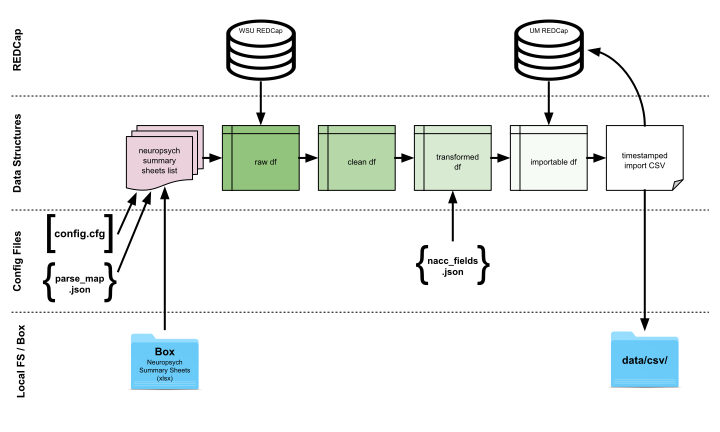

# Neuropsych Summary Sheet Scrape

## Purpose

The purpose of this project is to scrape the data from "Neuropsych Summary Sheets", which are spreadsheets used by Michigan Alzheimer's Disease Center Clinical Core to (1) quickly record and calculate key neuropsychological battery scores immediately after manual scoring and (2) consolidate those scores in one place for easy human readability.


## Script Procedure Description

1. Get list of Box item objects for each valid "Neuropsych Summary Sheet" (`.xlsx` extension).

2. Load parse map that details how to extract data from Neuropsych Summary Sheets (`parse_map.json`).

3. Build raw DataFrame from list of Box item objects.

4. Clean raw DataFrame.

    a. Drop dud records (e.g., missing `redcap_event_name` or `form_date` values).
   
    b. Normalize IDs (e.g., 1234 => UM00001234).
     
5. Transform clean DataFrame.

    a. Reshape data for IVP & FVP NACC fields (e.g., `mocatots` => `fu_mocatots`).
    
6. Prevent premature record upload.

    a. Get completed-forms records from REDCap as DataFrame.
    
    b. Inner join completed-forms DataFrame and transformed DataFrame on `ptid` and `redcap_event_name`.
    
7. Write joined data to CSV.

8. Import records directly into REDCap via API.




## Installation

Python 3.6 or higher is required.

1. Navigate to parent directory and clone the repo:

    ```shell script
    git clone git@git.umms.med.umich.edu:ldmay/neuropsych-summary-scrape.git
    ```
   
2. `cd` into the `neuropsych-summary-scrape` directory:

    ```shell script
    cd neuropsych-summary-scrape
    ```

3. Copy `config.cfg.template` to `config.cfg`:

    ```shell script
    cp resources/config/config.cfg.template resources/config/config.cfg
    ```

3. Update `config.cfg` Box JWT file path, Box root folder ID, regular expressions, and REDCap API credentials: 

    ```shell script
    vim resources/config/config.cfg
    ```
   
4. Set up Python virtual environment (if necessary):

    ```shell script
    python3 -m venv ./venv/
    ```
   
5. Activate the Python virtual environment (if necessary):

    ```shell script
    source venv/bin/activate
    ```

6. Install necessary Python packages in your environment: 

    ```shell script
    python3 -m pip install -r requirements.txt
    ```

## Use

Most of the information that app needs to run should be preconfigured in the `config.cfg` and `.json` files.

You can simply run the script:

```shell script
python3 neuropsych_summary_scrape.py
```

Errors not thrown by the app will go to stderr. Optionally, you can catch errors in a log file with Bash redirect:

```shell script
python3 neuropsych_summary_scrape.py 2>data/log/$(date +"%Y-%m-%d_%H-%M").err
```

You can also define the path the app will use to find resources it needs to run by supplying command line arguments:

```shell script
python3 neuropsych_summary_scrape.py \
  --app_path /path/to/neuropsych-summary-scrape \
  2>data/log/$(date +"%Y-%m-%d_%H-%M").err
```
